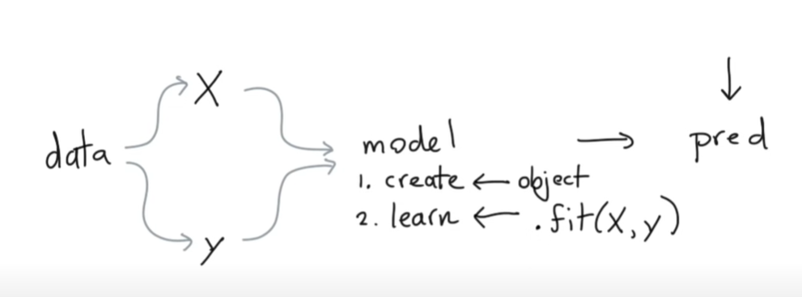
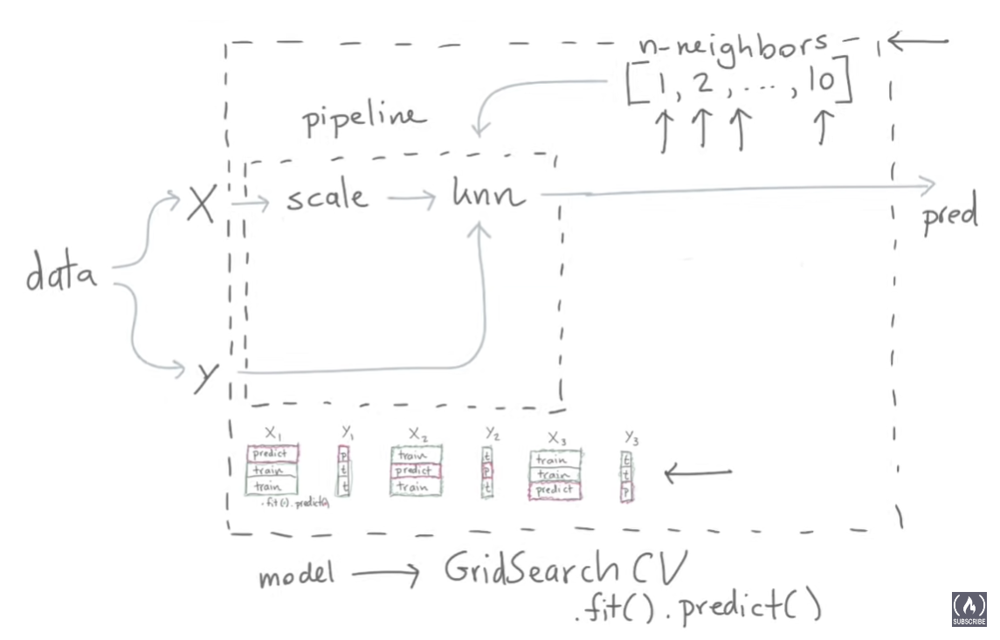
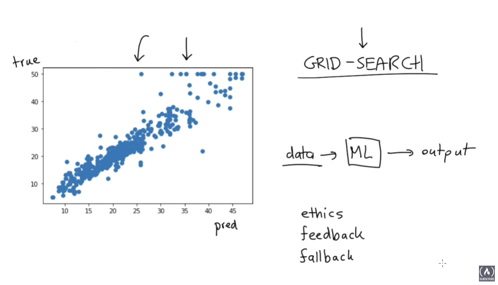

## Scikit-learn Crash Course - Machine Learning Library for Python

https://www.youtube.com/watch?v=0B5eIE_1vpU  (2:09:22)

---
- Part 1: Scikit-Learn
  - Folder scikit-learn
- Part 2: Preprocessing
  - Folder scikit-prep
- Part 3: Metrics
  - Folder scikit-metrics
- Part 4: Meta Estimators
- Part 5: Human-Learn
---

## Part 1: Scikit-Learn

Data -> Model -> Prediction

Data  -> X -> scale -> knn -> prep   -->pipeline=model=scale+knn

## Part 2: Preprocessing

